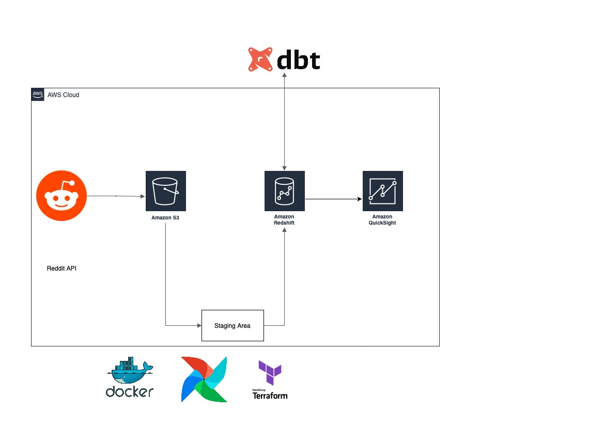
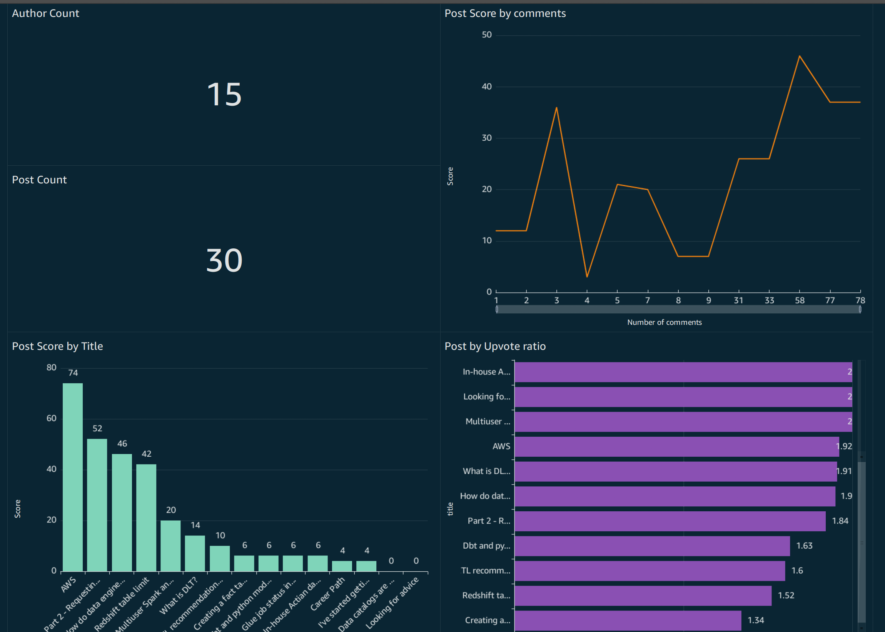
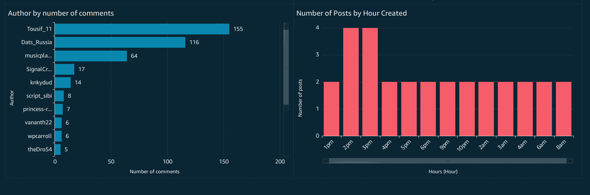
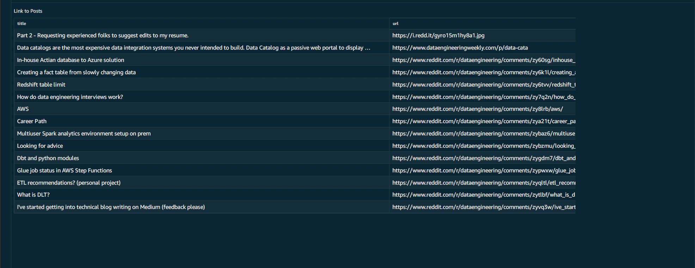
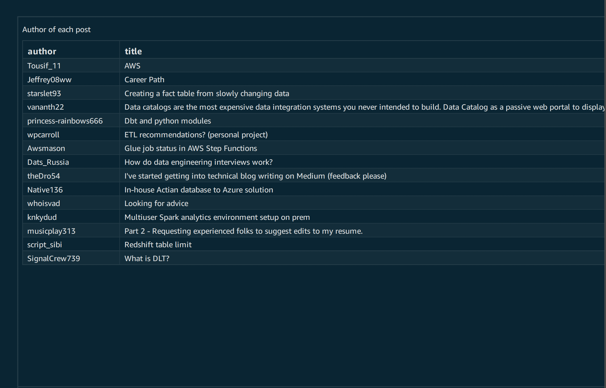

# Reddit-ELT-Pipeline
This project creates a data pipeline to extract data from reddit sub [r/dataengineering](https://www.google.com/url?sa=t&rct=j&q=&esrc=s&source=web&cd=&cad=rja&uact=8&ved=2ahUKEwiV5qu41aH8AhV2VaQEHa2NASAQFnoECBoQAQ&url=https%3A%2F%2Fwww.reddit.com%2Fr%2Fdataengineering%2F&usg=AOvVaw2VxlQ4Vi0wLbFf5nK0Nnw8)

Output is a Amazon QuickSight Dashboard report, providing some insights into the Data Engineering official subreddit.

## Motivation
Most People like to do fancy things with data, create ML models, create cool dashboards, but nobody ever asks, where did this data come from?
A model is only as good as the data it is trained on. Insights can only be accurately drawn on clean data.

My motivation for making this project is to provide Data scientists, data analysts, and Business analysts access to clean and structured data
This project provided me with a good opporttunity to learn DevOps and IaaC tools. 

## Architecture



1. Extract Data using Reddit API
2. Load Data into S3 Bucket - Our Data Lake
3. The Staging Area acts as an intermediary between the S3 Bucket and Redshift Cluster
4. The Redshift is a Data Warehouse - OLAP
5. Amazon QuickSight is used to create dashboards
6. Airflow is used as our workflow orchestrator
7. Docker is package airflow in a container
8. Terraform is an IaC tool used to provision our resources like S3 Bucket and Redshift Cluster
9. dbt is the T in ELT, used to provide tranformation logic to tables in our warehouse

## Output







Output from Amazon QuickSight dashboard link can be found here [link](https://us-east-1.quicksight.aws.amazon.com/sn/accounts/004743222442/dashboards/d08552d0-7cdb-4e90-9f3c-6b6623b9a82f?directory_alias=chukwudi)

The dashboard was created by using a SPICE dataset imported from a Redshift table

## Setup
Due to the fact the project is dockerized. It is portable, and easy to run on different host systems.
I use an M1 Macbook pro, so the docker architecture is linux/arm-64
Run the following commands
```
git clone https://github.com/ChukwudiOgbonna/Reddit-ELT-Pipeline
cd Reddit-ELT-Pipeline
terraform init
terraform apply
chmod +x output_terraform.sh
./output_terrafrom.sh
docker-compose up
```
This spins up the airflow containers, type the text below in your browser to open the airflow UI/webserver
```
http:localhost:8000
```

Simply go to te defined DAG, and click Trigger.
Thats all!!!


## Challenges/Improvements
1. The RedshiftSQL Operator does not support multi line SQL statements, seperate tasks had to be created to run the SQL commands
2. Airflow tasks create and close db sessions and temporary tables only last during a session. A table had to be used instead
3. A Makefile can be used to automate the process from provisioning resources using terraform, to injecting configuration variables to the containers and spinning up the containers


